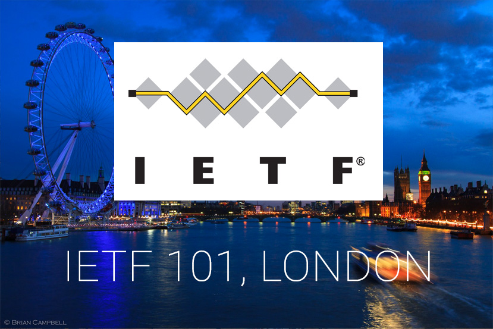

# My first IETF Meeting | Ma première confèrence de l'IETF

English readers : for the moment this story/log book is only in french... I hope to be able to translate it asap... if some of you want to help me, you're welcome ;-)

# Qu'est-ce que je fais là ?
Je suis allé plusieurs fois aux [RIPE Meetings](https://www.ripe.net/participate/meetings). C'est vraiment une belle confèrence, très intéressante, très dense, très fatiguante (pas de détail!). Ça allie les parties théorique, production et gouvernance de mon métier. Vraiment beaucoup de choses à apprendre : j'ai pu y puiser de nouvelles expériences, connaissances et surtout, à chaque fois, de nouvelles idées (pour mes collègues... et oui ! c'est quand même pas le chef va faire... non mais !).

J'y ai aussi beaucoup entendu parler des [IETF Meetings](https://www.ietf.org/how/meetings/upcoming/). Là où se discute (entre autres), les normes, les protocoles, les bons usages ... de l'Internet (entre autres). Tout est écrit sous forme de RFC ([Request for comments](https://fr.wikipedia.org/wiki/Request_for_comments)), dans une bibliothèque consultable [ici](https://www.rfc-editor.org/).

C'est un peu difficile de décrire simplement ici l'intérêt pour mon métier et pour moi pour suivre et participer à cette conférence. C'est la "source" de toutes les connaissances que j'apprie lors de mon cursus universitaire, des compétences que j'ai pu développer dans mon métier, des infrastructures, services et matériels que j'ai mise en place. *J'essayerai de trouver un parallèle sur d'autres métiers pour illustrer et tenter de faire une comparaison.*

Donc, voilà. Il se trouve que les IETF Meetings ont lieu un peu partout dans le monde et quelques fois en Europe, pas trop loin de la France. Là, en 2018, c'est à Londres du 17 au 23 mars. Bingo, je demande à mon employeur si je peux y aller et OK, c'est accepté. Cool.
